# IoT 스마트 주차장 시스템


## 동작 원리

1. 등록된 RFID 카드를 RFID 리더기에 태그하면 주차장 보안 시스템에 로그인할 수 있다. 그리고 LCD에 "SMART PARKING SYSTEM!"의 문구가 표시된다. 

   또한, 로그인한 상태에서는 언제든지 LED와 팬을 제어 가능하다.

2. 자동차가 주차장 앞으로 오면, 초음파 센서로 차의 위치를 센싱한다.  자동차가 주차장 문 앞 10cm 이내로 접근했을 때, 도어 버튼을 누르면 주차장 문이 열린다. 

3. 도어 스위치 또는 Bluetooth 어플의 도어 버튼 또는 웹사이트의 도어 버튼을 누르면 LCD에 "Opening doors"라고 표시되며, 부저가 울리고, LED가 켜지고, 주차장 문이 열린다. 

   문이 열리면 LCD에 "Door opened"라고 표시되고 부저가 울리고, 팬이 회전한다.

4. 도어 스위치 또는 Bluetooth 어플의 도어 버튼 또는 웹의 도어 버튼을 누르면  LCD에 "Closing doors"라고 표시되며, 문이 닫힌다. 

   문이 닫힌 후에 부저가 울리며 LCD에 "Doors closed"라고 표시된다. 

5. 도어 스위치 또는 Bluetooth 어플의 도어 버튼 또는 웹의 도어 버튼을 누르면 LCD에 "Opening doors"라고 표시되며, 문이 열린다. 

   문이 열리면  부저가 울리며, LCD에 "Door opened"라고 표시된다.

6. 도어 스위치 또는 Bluetooth 어플의 도어 버튼 또는 웹의 도어 버튼을 누르면  LCD에 "Closing doors"라고 표시되며, 문이 닫히고, 팬과 LED가 꺼지고 부저가 울린다. 

   LCD에 "Goodbye"라고 표시되고 로그아웃이 되며, 2.5초 이후 LCD에 "SMART PARKING SYSTEM!"의 문구가 표시된다.

   

---

* 시스템 순서도 (주차장 제어 기능)

.jpg)

---

* 시스템 순서도 (조명 및 환풍기 제어 기능)

.jpg)


## 시스템 구조


- 구조 개요

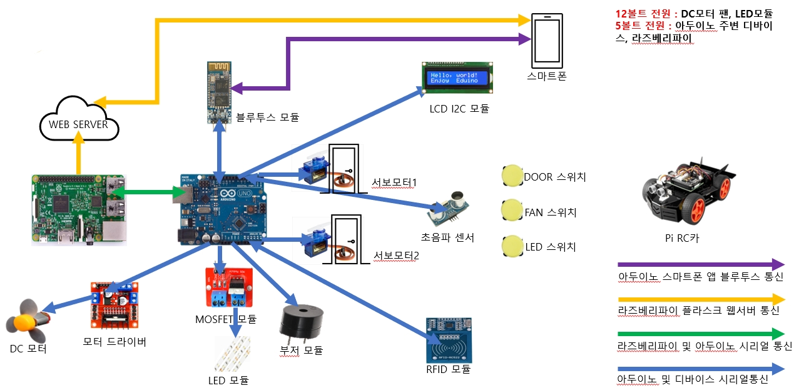

---

* 회로 (브레드보드)

 Ver.2.jpg)


## 구성 요소

### 라즈베리파이 3B+

**제품명 :** Raspberrypi 3B+ 


**용도 :**  웹서버를 통한 주차장 디바이스(서보모터, DC 모터, LED 스트립)제어하고 아두이노 우노와 시리얼로 연결되어 있다.

- System on chip : SOC / BCM2837 : System on chip은 컴퓨터 실행에 필요한 모든 부품을 하나 의 칩에 포함한 방식을 말한다. 라즈베리파이3는 CPU, GPU, RAM을 포함한 BCM2837(SoC), 라즈 베리파이 제로 W는 BCM2835(SoC)를 사용한다. 즉 컴퓨터의 CPU역할을 하며 발열이 많이 발생하니 방열판을 꼭 달아줘야 한다.

- GPIO 핀 (General Purpose Input Output) : 일반 PC와 라즈베리파이의 가장 큰 차이점 중 한 가 지가 바로 GPIO핀의 유무이다. 라즈베리파이는 GPIO핀을 통해 센서, 모터 등의 외부 장치와 통신 하고 통제할 수 있는 기능을 갖추고 있으며, 이를 통해 다양한 장치 구현 및 제어 시스템을 구축할 수 있다. 외부 기기들과 디지털 신호들만 주고받을 수 있으며 아날로그 신호는 지원하지 않는다. (ADC - DAC 컨버터를 사용하면 가능하다.)

- USB / Ethernet Chip : USB 포트와 이더넷 포트에 연결된 장치를 제어하기 위한 칩이다.

- USB / 마이크로 USB 포트 : 마우스, 키보드 등의 장치를 라즈베리파이에 연결할 수 있다.

- Ethernet Port : 랜선을 연결하여 인터넷 네트워크에 연결할 수 있다.

- Audio / RCA 포트 : 3.5mm 규격의 오디오 및 RCA 잭을 연결하여 소리를 출력할 수 있다.

- HDMI 포트 : 라즈베리파이의 HDMI 포트를 통해 모니터와 연결할 수 있다

- Micro USB 전원 입력 포트 : 라즈베리파이는 Micro 5핀 USB을 통해 DC 5V의 전원을 입력받아 작 동합니다. 안드로이드폰 충전기와 같은 규격이며, 라즈베리파이3 경우 2.5A어댑터를 권장하고 있다.

- CSI (Camera Serial Interface) 카메라 인터페이스 : 라즈베리파이 카메라를 연결하여 동영상이나 사진을 촬영할 수 있으며, 카메라는 일반용, 고해상도용, 어안 렌즈용, 야간용 등이 있다.

- DIS (Display Serial Interface) 디스플레이 커넥터 : 외부 디스플레이 장치를 연결하기 위한 커넥터 이며, 주로 터치스크린을 연결하기 위해 사용된다.

- Micro SD Card 소켓 (저장소) : 일반 컴퓨터는 하드디스크나 SSD를 저장소로 사용하는 반면 라즈 베리파이는 Micro SD 카드를 저장소로 사용하며, 8GB 이상을 권장한다. 라즈베리파이는 별도의 저장공간을 포함하고 있지 않고,  사용자가 원하는 OS(운영체제)를 SD Card에 저장하여 해당 소켓에 꽂아 사용하면 된다.

- 램 (RAM : Random Access Memory) : 데이터를 기록하거나 읽기 위한 저장공간이며, 램은 전 원이 끊어지면 기억되어있는 데이터들이 소멸되는 휘발성 메모리이다. 라즈베리파이3 모델은 1GB 의 램이 장착되어있습니다.

- 런 핀 (Run Rins for Reset Switch : 리셋을 위한 핀 타입의 버튼

- WiFi 802. 11 b/g/n 블루투스 4.1 (BLE) : 와이파이와 블루투스를 위한 칩

- USB Port : PC 혹은 보조 배터리로부터 5V 전원을 공급받아서 동작할 수 있다. UART 방식의 시리얼 통신을 통해 아두이노 보드와 통신이 가능하다.

  *참고* [RaspBerry PI 3 B+ (라즈베리파이) 보드 설명 :: 코딩 공부 일지 (tistory.com)](https://cocoon1787.tistory.com/28)

  

### 아두이노 우노

**제품명 :** Arduino Uno R3  

**용도 :**  주차장 통합 시스템 제어

아두이노 우노 보드는 ATmega328을 탑재한 보드로 14개의 디지털 입출력 핀(6개의 PWM출력핀 포함)과 6개의 아날로그 입력핀을 갖고 있다. FTDI 칩이 내장되어 있어 USB를 통해 바로 PC와 연결이 가능하며 5V, 3.3V 모두 지원한다. 

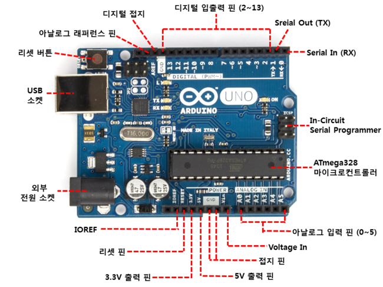

* USB Port : PC 혹은 보조 배터리로부터 5V 전원을 공급받아서 동작할 수 있다. UART 방식의 시리얼 통신을 통해 아두이노 보드와 통신이 가능하다.

* DC Barrel Jack : USB 포트 사용 대신 아두이노 단독으로 동작시킬 때 DC 파워잭에 7~12V DC 어댑터를 연결해서 전원을 공급하면 된다. 6V보다 낮으면 보드 동작 불안정, 20V보다 높으면 레귤레이터 손상이 발생할 수 있다. 

* Vin Pin : Vin에 '+' 전원, GND에 '-' 전원을 직접 연결해서 외부 전원을 공급할 수도 있다. 이 방법은 레귤레이터를 거치지 않으므로 원하는 전압만큼 보드에 전원을 공급할 수 있다. 

  배럴 잭과 동시에 사용하면 역전압에 의해 화재 가능성이 있다. 최대 전류는 1A이다.

* Voltage Regulator : 7~12V 의 외부전원을 아두이노가 동작하는데 필요한 5V로 바꾸어주는 역할을 한다.  최대 1A정도의 전류까지 처리할 수 있다.

* 5V Output Pin : 보드 상의 레귤레이터에서 생성된 5V를 출력한다. 

* 3.3V Output Pin : 보드 상의 레귤레이터를 통해 3.3V를 출력하며, 최대 전류는 50mA이다.

* Digital Input/Output Pin (0~13) : 디지털 데이터의 입출력을 위한 핀이며, 0V/5V의 2가지 값을 갖는다. pinMode(pin, mode), digitalWrite(pin, value), 그리고 digitalRead(pin)라는 함수로 사용 가능하다. 

  핀당 전류의 권장량은 20mA, 최대량은 40mA이며, 20~40kΩ의 풀업 저항을 내장하고 있다. 특정 핀은 부가 기능을 가진다.

  * Serial - 0(Rx), 1(Tx) : 타 장치와의 통신을 위해 사용하며, 데이터 전송을 위한 Tx 핀과 데이터 수신을 위한 RX 핀으로 구성된다. 

    아두이노 보드에는 1개의 시리얼 포트만 제공되는데, USB 시리얼 통신과 Rx/Tx 시리얼 통신은 같은 포트를 사용하기 때문에 둘을 동시에 쓸 수 없다. 하지만 SoftwareSerial 라이브러리를 사용하면 일반 디지털 핀을 시리얼 포트로 사용할 수 있어, 2개 이상의 장치와 통신할 수 있게 된다. 

    다른 장치와 연결 시 Tx와 Rx를 교차로 연결해야 한다. 시리얼 통신을 사용하기 위해서는 Serial.begin(speed) 함수로 시리얼 통신 포트를 초기화하고 통신 속도를 설정해야 한다.

  * External Interrupts - 2, 3 : 2, 3번 핀을 통해 외부 인터럽트 기능을 쓸 수 있다.

  * PWM - 3, 5, 6, 9, 10, 11 :  analogWrite(pin, value)  함수를 통해 8 Bit(0~255)의 PWM 출력이 가능하다. 옆에 '~' 표시가 되어 있다.

  * SPI - 10(SS), 11(MOSI), 12(MISO), 13(CSK) : SPI 통신을 지원한다. SPI 통신은 1:N연결을 지원하고 Master-Slave 모드로 통신한다. 또한 SPI 통신은 송신과 수신이 동시에 이뤄지는 전이중(Full Duplex) 방식을 이용하기 때문에 I2C 통신보다 속도가 빠르다. 

    클럭 신호를 보내는 SCK(Serial Clock) 핀, 마스터로부터 슬레이브로 데이터를 전달하는 MOSI(Master Output, Slave Input) 핀, 슬레이브로부터 마스터로 데이터를 전달하는 MISO(Master Input, Slave Output) 핀,  슬레이브를 선택하는 SS(Slave Select)으로 구성된다.

  * LED - 13 : 13번 핀은 아두이노에 내장되어있는 LED에 연결되어 있다.

* Analog Input Pin - A0~A5 : 아날로그 입력값을 읽어들이는 핀으로, 주로 센서와 연결해서 사용한다. ADC가 10 bit의 분해능을 갖기 때문에, 총 1024개의 단계를 가지며 0~5V(기준 전압) 사이의 전압 입력값은 0부터 최대 1023 사이의 숫자로 변환된다. 

  analogRead(pin) 함수로 값을 읽을 수 있다. 필요에 따라서 디지탈 핀으로도 사용될 수 있다.

  * I2C - A0, A1 : I2C 통신을 지원한다. SPI 통신은 1:N연결을 지원하고 Master-Slave 모드로 통신한다. 데이터 송수신을 위한 SDA와 동기화 클록을 위한 SCL 핀 2개만을 사용한다. 

    송수신이 따로 이뤄지는 반이중(Half Duplex) 방식을 사용하기에, SPI나 시리얼 통신에 비해 속도가 느린 편이다. 그러나 SPI와 달리 Wire라이브러리에서 슬레이브 모드를 지원하고, UART와 달리 1:N통신이 지원되므로 비교적 간단하게 다양한 기능 구현이 가능하다.

* Analog Reference Pin - AREF : 최대(기준) 전압 값 설정을 하는 핀으로, 아두이노 보드에서 아날로그 신호를 읽어올 때 보드의 동작 전압(5V) 대신 외부의 전압을 기준으로 잡고 싶은 경우 사용한다. 

  실제 보드의 동작 전압이 5V에 미치지 못하는 경우 analogRead(pin) 함수로 측정한 전압과 실제 전압에 오차가 발생할 수 있으므로, AREF 핀에 인가된 전압을 레퍼런스 전압으로 사용해서 오차를 보정한다.  

  그리고 아날로그 입력에서 받는 신호 범위를 5V 미만으로 감소시키면 더 촘촘하고 세밀한 측정값을 얻을 수 있으나, 이 경우 AREF 전압~5V 사이의 전압은 측정할 수 없다.

   AREF 핀에 0V 미만 또는 5V 이상을 인가하면 내부 생성된 기준 전압과 AREF 핀이 단락되어 보드가 손상될 수 있으므로 주의한다. analogReference(type) 함수로 사용 가능하다.

  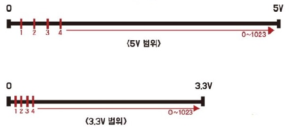

***

### 택트 스위치

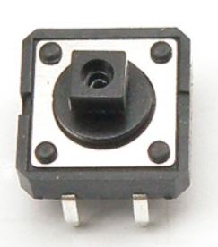

**제품명 :** DM626  

**용도 :** 조명, 환풍기, 주차장 문 제어 기능

digitalRead(pin) 함수를 통해 스위치의 상태를 확인한다. pinMode(pin, mode) 함수로 특정 핀을 입력으로 설정할 때, 아두이노의 내부 풀업 저항을 이용하기 위해 INPUT_PULLUP 입력 모드를 사용한다.

* Swtich OPEN : 입력 핀으로 전류가 흘러 5V가 걸리고 HIGH가 입력됨.
* Switch CLOSED : 모든 전류가 GND로 흐르게 되어 입력 핀에 0V가 걸리고 LOW가 입력됨.


***

### Bluetooth 모듈

**제품명 :** HC-06  

**용도 :** 블루투스 통신을 통해 주차장 시스템을 원격 제어

HC-06은 아두이노에서 시리얼 통신을 통해 데이터를 주고받을 수 있다. 블루투스 기능이 있는 스마트폰 기기를 인용해서 아두이노에 연결된 블루투스 모듈로 신호를 보낸다. 초기에 LED가 깜빡이다가 다른 기기와 페어링이 이뤄지면 LED가 계속 켜진 상태가 된다. 

스마트폰 앱으로 HC-06에 ASCII 코드 형태로 데이터를 보내 아두이노로 전송되면, 이를 바탕으로 주차장 제어 기능이 실행된다.

* msg_app == 'L'  →  Light ON/OFF
* msg_app == 'F'  →  Fan ON/OFF and Power Adjustment
* msg_app == 'D'  →  Garage Door Open/Close

***

### 초음파 센서


**제품명 :** HC-SR04  

**용도 :** 주차장 문과 차량 간의 거리 측정

송신부(TRIG 핀)에서 일정한 시간의 간격을 둔 짧은 초음파 펄스를 방사하고, 대상물에 부딪혀 돌아온 에코 신호를 수신부(ECHO 핀)에서 받아, 이에 대한 시간차를 기반으로 거리를 산출한다.
$$
distance (cm) = ((340*100) * (duration/1000000))/2
$$
수식에서 왕복 시간 duration은 µs 단위이므로, s 단위로 변환하기 위해 1000000을 곱한다. 이후 거리 계산값을 2로 나누어 센서와 차량 간의 편도 거리를 구한다.

***

### RFID 모듈


**제품명 :** RFID-RC522  

**용도 :** 보안 시스템 구현, 거주자의 ID 카드를 통해서만 주차장에 액세스 가능

무선 주파수를 통해 직접적인 접촉 없이 정보를 전달 가능하다.

RFID는 고유 ID를 저장하는 태그, 데이터 송수신을 돕는 안테나, ID 데이터를 읽는 리더, 분산된 리더 시스템을 관리하는 호스트로 구성된다.

태그를 리더에 가까이 가져가면 리더가 발생시킨 자기장에 의해 태그의 코일에서 유도 전류가 발생한다. 이에 따라 태그에 내장된 IC에 전원이 공급되고, 태그의 데이터가 리더의 안테나로 전송된다.

서버는 리더가 읽어들인 데이터를 비교, 판독하고 결과 데이터를 리더에게 전송하여 대상을 식별할 수 있게 된다. 

아두이노와 통신하기 위해 SPI 통신 방식으로 연결해서 사용한다.

RFID 리더기가 카드의 ID 데이터를 읽고, 태그된 ID가 거주자의 ID와 일치할 경우에만 주차장 시스템에 액세스할 수 있다.

***

### LCD 디스플레이 모듈

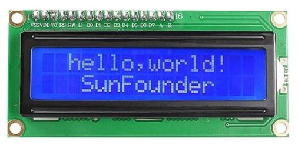

**제품명 :** LCD 1602 4-pin display module 

**용도 :**  다양한 경우에서의 알림 메시지 출력

LCD 디스플레이 모듈은 16칸, 2줄로 구성되어 총 32문자의 영문 텍스트를 표시 가능하며, 5V 전원으로 구동된다. 뒷면의 가변 저항을 돌려서 백라이트의 밝기를 조절할 수 있다. LCD 디스플레이 라이브러리 <LiquidCrystal_I2C.h>을 사용한다.

아두이노와 통신하기 위해 I2C 통신 방식으로 연결해서 사용한다. 

***

### LED 스트립 & MOSFET 모듈  

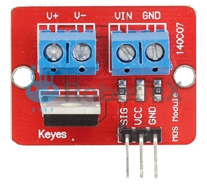    

**제품명 :**  레토 DIY 간접 무드등 LED 줄조명, IRF520 MOSFET module

**용도 :**  외부 12V 전원을 통해 조명 구동

외부 전원으로 LED를 동작시키기 위해 IRF520 MOSFET 모듈을 활용한다.

SIG 핀으로 PWM 신호를 입력해서 LED의 밝기를 조절한다. VIN 단자에 12V를 인가하고, V+와 V- 출력 단자와 LED를 연결하여 동작시킨다.

***

### 피에조 수동 부저

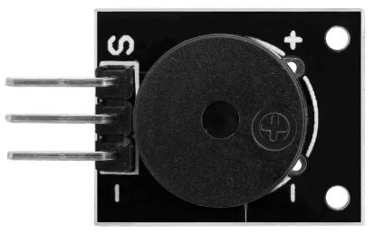

**제품명 :**  KY-006

**용도 :**  도어벨 용도 및 주차장 문 개폐 시 경보음 출력

피에조 효과를 통해 음향을 출력하며, 능동 피에조 부저와 수동 피에조 부저로 나뉜다.

능동 부저는 전압이 인가되기만 하면 소리가 나는 반면, 수동 부저는 주파수를 설정해서 출력하고자 하는 소리를 낼 수 있다.

임의의 핀을 버저 혹은 스피커와 연결한 후, tone(pin, frequency) 함수로 원하는 주파수의 소리를 재생할 수 있다. frequency 변수 타입이 unsigned int 형이기 때문에, 출력 가능한 주파수의 범위는 31~65535Hz이다.

***

### DC 모터 & 모터 드라이버

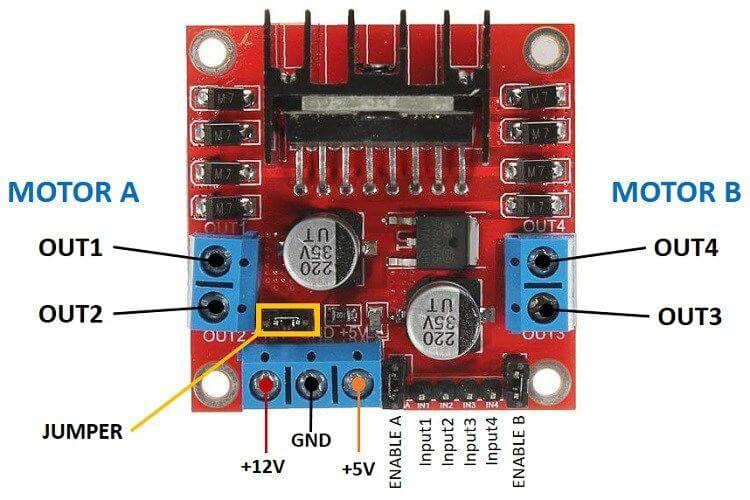

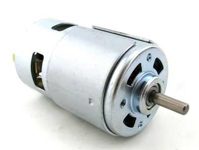

**제품명 :**  DC motor, L298N motor driver module

**용도 :**  외부 12V 전원을 통해 환풍기 구동 및 팬의 회전 속도 조절

DC 모터는 전류의 흐름대로 단방향 회전만 할 수 있으며, 구조가 간단하고 회전 제어가 쉽다.

외부 전원으로 DC 모터를 동작시키기 위해 L298N 모터 드라이버 모듈을 활용한다.

L298N은 Dual Half-Bridge 모터 드라이버 모듈로, 2개의 DC 모터 또는 스텝 모터를 동시에 제어 가능하며, 하나의 전원으로 모터에 인가되는 전압의 극성을 바꿀 수 있다.

INPUT 단자는 방향을 제어하기 위한 신호선이며, ENABLE 단자는 모터의 출력을 제어하는 신호선이다.

DC 모터의 전원은 12V를 사용하며, IN3 핀에 5V(HIGH), IN4 핀에 0V(LOW)를 인가해서 회전 방향을 고정시킨다. 또한 EN 핀에 PWM 신호를 입력해서 모터의 회전 속도를 3단계로 조절한다.

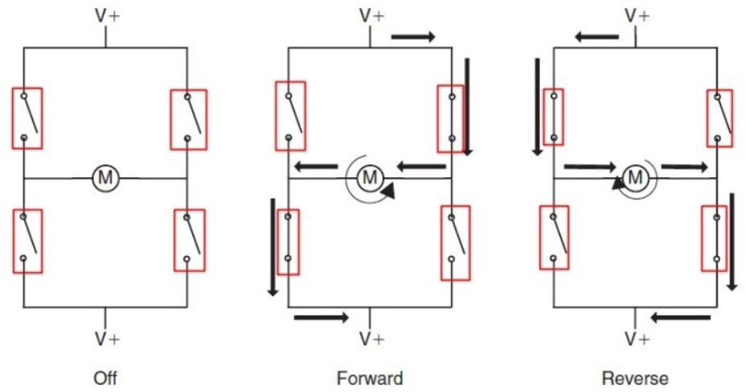

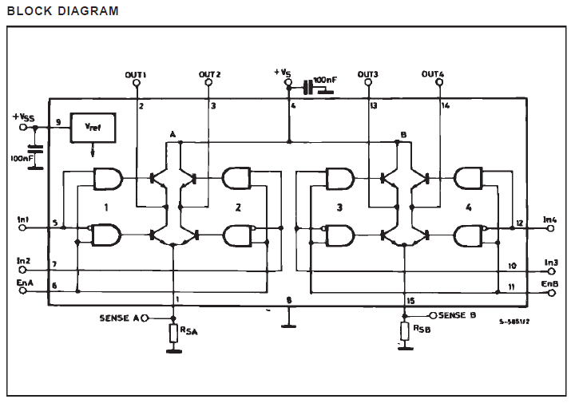

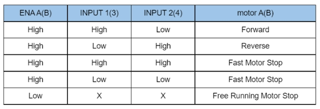

***

### 서보 모터

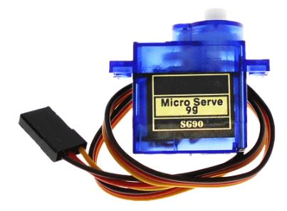

**제품명 :**  SG90

**용도 :**  주차장 문을 열고 닫음

서보 모터는 일반 DC 모터에 피드백 회로를 내장하여 정밀한 위치 및 속도 제어가 가능하게 구성된 모터이다. 회전을 센서가 감지하여 제어부로 신호를 보내 동작을 제어한다. PWM 신호의 duty cycle 값에 따라 회전 각도가 달라지며, 0~180°의 각도까지 회전할 수 있다. 고유의 서보 모터 라이브러리 <Servo.h>를 사용한다.

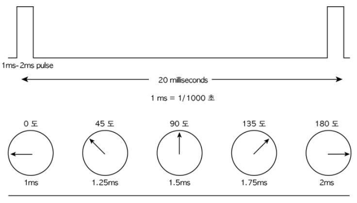

서보 모터의 오차를 감안하여 모터 1의 개문 시 각도는 13°, 폐문 시 각도는 110°, 모터 2의 개문 시 각도는 180°, 폐문 시 각도는 83°로 설정했다. 따라서 모터 1과 모터 2는 반대 방향으로 회전하게 된다.

* OPEN)   Motor 1 : 13° → 110°  &  Motor 2 : 180° → 83° 
* CLOSE)  Motor 1 : 110° → 13°  &  Motor 2 : 83° → 180° 


## 코드 구성


### Raspberry Pi

**코드 내용 : 플라스크 웹서버 생성, 아두이노와 연결된 디바이스 제어 **

```python
from flask import Flask, request, render_template
import serial
import time

app = Flask(__name__)

ser = serial.Serial('/dev/ttyACM0',9600, timeout=1)
ser.flush()

@app.route('/')
def home():
    return render_template("index.html")

@app.route('/data', methods = ['POST'])
def data():

            data = request.form['control']

            if(data == 'led_on&off'): # LED ON/OFF code
                    ser.write(b"L") # Write "L" to arduino     
                    return home()

            elif(data == 'fan_on&off'): # FAN OF/OFF code
                    ser.write(b"F") # Write "F" to arduino
                    return home()

            elif(data == 'door_open&close'): # DOOR OPEN/CLOSE code
                    ser.write(b"D") # Write "D" to arduino
                    return home()
        
if __name__ == '__main__':
    app.run(host = '192.168.0.31', port = '80')

```

***

```html
<!DOCTYPE html>
<html>
  <head>
    <meta charset="UTF-8:">
    <title>Smart Parking Area : LED, FAN, DOOR Control </title>
  </head>
  <body>
    <h1> LED, FAN, DOOR ON/OFF </h1>
    <form action="/data" method="post">
      <input type="submit" name="control" value="led_on&off">
      <input type="submit" name="control" value="fan_on&off">
      <input type="submit" name="control" value="door_open&close">
    </form>
  </body>
</html>
```


### Arduino Uno 

**코드 내용 : 아두이노와 연결된 디바이스 제어**

```C
#include <SoftwareSerial.h>
#include <Servo.h>
#include <SPI.h>
#include <MFRC522.h>
#include <LiquidCrystal_I2C.h>
#include "Pitches.h"

#define SERVO_PIN1 A0 // servo motor1 data pin 
#define SERVO_PIN2 A1 // servo motor2 data pin 
#define DC_MOTOR 6    // ventilator fan data pin
#define ECHO 2        // ultrasonics wave echo 
#define TRIG 3        // ultrasonics wave trigger
#define SW1 0         // LED on & off switch    
#define SW2 4         // ventilator fan on & off switch   
#define SW3 A2        // door open & close switch  
#define LED 5         // LED data pin   
#define BUZZER A3     // buzzer data pin
#define ARDUINO_TX 7  // Arduino Tx pin - Bluetooth Rx pin 
#define ARDUINO_RX 8  // Arduino Rx pin - Bluetooth Tx pin 
#define RST_PIN 9     // RF module
#define SS_PIN 10     // RF module SDA pin


SoftwareSerial bt(ARDUINO_RX,ARDUINO_TX);          // Arduino - Bluetooth module
LiquidCrystal_I2C lcd(0x27, 16, 2);                // LCD has 16 columns, 2 rows on screen

MFRC522 rfid(SS_PIN, RST_PIN);                     // RF module
const int rfid_pass[4] = {0x91, 0xE3, 0xCD, 0x1B}; // card ID: 91/E3/CD/1B -> Byte[0]/Byte[1]/Byte[2]/Byte[3]

Servo myservo1;                                    // servo motor1
Servo myservo2;                                    // servo motor2
const int open_angle[2] = { 13, 180 };             // angle[0] - > servo1 & angle[1] = servo2
const int close_angle[2] = { 110, 82 };            // the difference between the open and closed angles is 97 degree

float distanceCM; // distance between car and parking
int switch1_mode; // switch1 mode on or off
int switch2_mode; // switch2 mode of or off
int switch3_mode; // switch3 mode of or off
char msg_app;     // msg_app from arduino bluetooth app
char msg_web;     // msg_web from raspberrypi web

/*buzzer doorbell sound, every element other than NOTE below is zero-initialized*/
const int melody[2][50] = { {NOTE_AS4, NOTE_F4, NOTE_C5, NOTE_D5, NOTE_F5}, // tone of sound 
                            {400, 200, 400, 400, 400} };                    // play time of sound 


/*status : LED, DOOR, FAN, PARKING, RF_TAG*/
int led_status = 0; 
int door_status = 0;
int fan_status = 0;
int parking_status = 0;
int rfid_status = 0;


void setup() 
{
  Serial.begin(9600);         // Serial Communication 
  bt.begin(9600);             // Bluetooth Communication
  
  pinMode(TRIG, OUTPUT);      // ultrasonic wave sensor trigger pin
  pinMode(ECHO, INPUT);       // ultrasonic wave sensor echo pin
  
  myservo1.attach(SERVO_PIN1);// servo motor1
  myservo2.attach(SERVO_PIN2);// servo motor2 
  myservo1.write(close_angle[0]);        // init servo motor 1
  myservo2.write(close_angle[1]);        // init servo mortor 2
  
  pinMode(SW1, INPUT_PULLUP); // switch for LED On/Off
  pinMode(SW2, INPUT_PULLUP); // switch for fan On/Off
  pinMode(SW3, INPUT_PULLUP); // switch for door Op/Cs & LED On & FAN On
  pinMode(LED, OUTPUT);       // LED pin output
  pinMode(BUZZER, OUTPUT);    // BUZZER pin output
  digitalWrite(LED, LOW);     // init LED off status 

  /*RF module*/
  SPI.begin(); 
  rfid.PCD_Init();

  /*LCD*/
  lcd.init();
  lcd.backlight();
  show_LCD( " SMART PARKING      SYSTEM!    " );
}


void loop() 
{
    rf_module();                     // sensing if RF is tagged
    distanceCM = measure_distance(); // sensing the distance between car and parking
    read_switchMode();               // reading values of "SW1" & "SW2" : 1 -> no pushing , 0 -> pushing
    msg_app = 'A';                   // initializing the "msg_app" from smartphone bluetooth app
    msg_web = 'W';                   // initializing the "msg_web" from raspberrypi server web
    read_bluetooth();                // reading "msg_app" from smartphone bluetooth app
    read_web();                      // reading "msg_web" from raspberrypi server web
    print_status();
/***if you tag the owner RFID card, you can open the door***/
if (rfid_status == 1)
{
  /*When I stand in front of the garage.*/
  if (door_status == 0 && parking_status == 0)
  {  
    if (switch3_mode == 0 || msg_app == 'D' || msg_web == 'D')  // push down the switch3 or the door on/off button of app or the door on/off button of web 
     {
        if (distanceCM > 10)
        {
          show_LCD( "Please get your car closer." );
          return;
        }
        
        /*distanceCM <= 10*/
        show_LCD( "Opening doors" );
        buzzer_sound(150);
        led_on();                   // turn on the LED when the door is opened
        move_servo("open");
        show_LCD( "Doors opened!" );
        buzzer_sound(500);
        analogWrite(DC_MOTOR, 90);  // turn on the fan when the door is opened

        led_status = 1;
        door_status = 1;
        parking_status = 1;
        fan_status = 1;
        
        print_status(); // print status (distance, led_status, door_status, parking_status, switch mode, rfid_status)
     }
  }
  /*Close the door when I finished parking my car.*/
  else if (door_status == 1 && parking_status == 1)
  {
    if (switch3_mode == 0 || msg_app == 'D' || msg_web == 'D')  // push down the switch3 or the door on/off button of app or the door on/off button of web
     {
        show_LCD( "Closing doors" );
        move_servo("close");
        show_LCD( "Doors closed!" );
        buzzer_sound(500);
        
        door_status = 0;
        
        print_status(); // print status (distance, led_status, door_status, parking_status, switch mode, rfid_status)
     }
  }
  /*Open the door before the car goes out.*/
  else if (door_status == 0 && parking_status == 1)
  {
    if (switch3_mode == 0 || msg_app == 'D' || msg_web == 'D')  // push down the switch3 or the door on/off button of app or the door on/off button of web
     {
        show_LCD( "Opening doors" );
        move_servo("open");
        show_LCD( "Doors opened!" );
        buzzer_sound(500);
        
        door_status = 1;
        parking_status = 0;

        print_status(); // print status (distance, led_status, door_status, parking_status, switch mode, rfid_status)
     }
  }
  /*Close the door when the car goes out.*/
  else if (door_status == 1 && parking_status == 0)
  {
    if (switch3_mode == 0 || msg_app == 'D' || msg_web == 'D')  // push down the switch3 or the door on/off button of app or the door on/off button of web
     {
        show_LCD( "Closing doors" );
        move_servo("close");
        analogWrite(DC_MOTOR, 0);  // turn off the fan when the door is closed
        led_off();                 // turn off the LED when the door is closed
        buzzer_sound(500);
        show_LCD( "    Goodbye    " ); 
        delay(2500); 
        show_LCD( " SMART PARKING      SYSTEM!    " );
        
        led_status = 0;
        door_status = 0;
        fan_status = 0;
        
        rfid_status = 0;// reset rfid_status
        print_status(); // print status (distance, led_status, door_status, parking_status, switch mode, rfid_status)
     }
  }
  /***finish the situation of parking and going out***/

     rf_module(); // check if RF is tagged
     delay(500);  // end of the process

 
  /*When you want to turn on/off the LED*/   
  if ((switch1_mode == 0 || msg_app == 'L' || msg_web == 'L') && led_status == 0)
  { 
      show_LCD( "Light turned on" );
      led_on(); 
      led_status = 1;
      print_status(); // print status (distance, led_status, door_status, parking_status, switch mode, rfid_status
  }
  else if ((switch1_mode == 0 || msg_app == 'L' || msg_web == 'L') && led_status == 1)
  { 
      show_LCD( "Light turned off" );
      led_off(); 
      led_status = 0;
      print_status(); // print status (distance, led_status, door_status, parking_status, switch mode, rfid_status 
  }

  /*When you want to turn on/off the fan and adjust the wind power*/
  if (switch2_mode == 0 || msg_app == 'F' || msg_web == 'F')
  {
        
    switch (fan_status)
    {
      case 0:
        show_LCD( "Wind Power:     WEAK" );
        analogWrite(DC_MOTOR, 90);   // average voltage delivered to DC motor = (90/255)*12V = 4.2V
        fan_status = 1;
        print_status();
        break;
        
      case 1:
        show_LCD( "Wind Power:     INTERMEDIATE" );
        analogWrite(DC_MOTOR, 100);   // average voltage delivered to DC motor = (100/255)*12V = 4.7V
        fan_status = 2;
        print_status();
        break;
        
      case 2:
        show_LCD( "Wind Power:     STRONG" );
        analogWrite(DC_MOTOR, 110);   // average voltage delivered to DC motor = (110/255)*12V = 5.2V
        fan_status = 3;
        print_status();
        break;
        
      case 3:
        show_LCD( "Fan turned off" );
        analogWrite(DC_MOTOR, 0);   
        fan_status = 0;
        print_status();
        break;    
    }
  }
  
    fflush(stdin);
    
} // rfid_status = 1
    

} // loop end


/*the function of sensing the distance between a car and the parking area door*/
float measure_distance()
{
  digitalWrite(TRIG, LOW);
  delayMicroseconds(3);   // wait until TRIG pin is stabilized
  digitalWrite(TRIG, HIGH);
  delayMicroseconds(10);  // transmit pulse for 10us
  digitalWrite(TRIG, LOW);

  // read comeback time of the reflected sound
  unsigned long duration = pulseIn(ECHO, HIGH);  
  
  // (34000cm * (duration)sec)/2 -> distance between sersor and car
  float distance = ((340.0*100.0) * (duration/1000000.0))/2.0;  
  return distance;
}

/*the function of sensing switches on/off*/
void read_switchMode()
{
    switch1_mode = digitalRead(SW1);   // LED switch, switch1_mode = 0 -> on, 1 -> off
    switch2_mode = digitalRead(SW2);   // FAN switch, switch2_mode = 0 -> on, 1 -> off
    switch3_mode = digitalRead(SW3);   // door switch, switch3_mode = 0 -> closed, 1 -> open
}

/*the function of turning on the led*/
void led_on()  
{
  if (led_status != 0)    // if led is already ON, return
    return;
  
  for (int i = 0; i <= 140; ++i)
  {
    analogWrite(LED, i);
    delay(3);
  }
}

/*the function of turning off the led*/
void led_off()
{
  if (led_status == 0)    // if led is already OFF, return
    return;
  
  for (int i = 140; i >= 0; --i)
  {
    analogWrite(LED, i);
    delay(3);
  }  
}

/*the function of buzzer alarm*/
void buzzer_sound(int period)
{
    tone(BUZZER, NOTE_B5);
    delay(period);
    noTone(BUZZER);
}

/*the function of buzzer music*/
void buzzer_music() 
{
  for (int i = 0; ; i++)
  {
    tone(BUZZER, melody[0][i]);   // play the music according to melody array
    delay(melody[1][i]);

    if (melody[0][i] == 0)    // stop the music when the element is zero value
    {
      noTone(BUZZER);
      break;
    }
  } 
}

/*the function of reading the value from bluetooth app*/
void read_bluetooth()
{
  if (bt.available())   // if bluetooth module receives data in the form of ASCII code
  {
    msg_app = bt.read();  // read the value of ASCII code 
    delay(500);
  }
}

/*the function of reading the value from raspberrypi web*/
void read_web()
{
  if (Serial.available()>0)
  {
    msg_web = Serial.read(); // from raspberrypi
  }
}

/*the function of opening and closing the parking area door by using servo motor*/
void move_servo(String mv)  
{
    if (mv == "open")
    {
      for (int angle = 0; angle <= 97; angle++)
      {
        myservo1.write(close_angle[0] - angle);  /* (closing) servo1: 110->13, servo2: 83->180 */        
        myservo2.write(close_angle[1] + angle);         
        delay(30);
      }
    }

    else if (mv == "close")
    {
      for (int angle = 0; angle <= 97; angle++)
      {
        myservo1.write(open_angle[0] + angle);   /* (opening) servo1: 13->110, servo2: 180->83 */ 
        myservo2.write(open_angle[1] - angle);   
        delay(30);
      }
    }
}

/*the function of waiting a owner rf id card tagging, only owner card can help all controls of parking area*/
void rf_module()
{  
    if (rfid.PICC_IsNewCardPresent()) 
    {
        
        if (rfid.PICC_ReadCardSerial())
        { 
            
            Serial.print(" RFID = ");
            printHex(rfid.uid.uidByte, rfid.uid.size);

            if (rfid.uid.uidByte[0] == rfid_pass[0] && rfid.uid.uidByte[1] == rfid_pass[1] && rfid.uid.uidByte[2] == rfid_pass[2] && rfid.uid.uidByte[3] == rfid_pass[3])
            {   // you will get access to the parking area if tagged card ID is the same as owner's card ID 
               show_LCD( "Welcome to      We've PAVILION!" );
               
               if (rfid_status == 1)
               {
                  show_LCD( "You've already  tagged the card!" );    // if rfid_status == 1
                  delay(2000);                                      
                  show_LCD( "Welcome to      We've PAVILION!" );
               }
               else
               {
                  buzzer_music();   // if rfid_status == 0, sound the buzzer.
                  rfid_status = 1;
               }  
            }
            
            else // if tagging the other ID card
            {
               if (rfid_status == 1)
               {
                  show_LCD( "You've already tagged the card!" );    // if rfid_status == 1
                  delay(2000);
                  show_LCD( "Welcome to      We've PAVILION!" );
               }
               else
               {
                  show_LCD( "Please use the  correct ID card." );
                  delay(2000); 
                  show_LCD( " SMART PARKING      SYSTEM!    " );
                  rfid_status = 0;
               } 
            }

            rfid.PICC_HaltA();        // Halt PICC
            rfid.PCD_StopCrypto1();   // Stop encryption on PCD
        }
    }   
}

/* printing RFID ID number */
void printHex(byte *buffer, byte bufferSize) 
{
  for (byte i = 0; i < bufferSize; i++) 
  {
      Serial.print(buffer[i] < 0x10 ? " 0" : " ");
      Serial.print(buffer[i], HEX);
  }
  Serial.println();
}

/*printing the text on the LCD*/
void show_LCD(String text) 
{
  lcd.clear();
  lcd.setCursor(0,0);
  
  for (int i = 0; i < text.length(); ++i)
  {
    if (i < 16) 
    {
      lcd.setCursor(i,0);
      lcd.print(text[i]);           
    }
    else  // new line if there are more than 16 letters
    {
      lcd.setCursor(i - 16,1);
      lcd.print(text[i]);     
    }
  }

}

/*the function of printing the status of parking area on the arduino serial monitor*/
void print_status()
{  
  Serial.print("switch1_mode / switch2_mode / switch3_mode : ");
  Serial.print(switch1_mode);
  Serial.print(" / ");
  Serial.print(switch2_mode);
  Serial.print(" / ");
  Serial.println(switch3_mode);
  Serial.print("distance : ");
  Serial.println(distanceCM);
  Serial.print("led_status / fan_status / door_status / parking_status : ");
  Serial.print(led_status);
  Serial.print(" / ");
  Serial.print(fan_status);
  Serial.print(" / ");
  Serial.print(door_status);
  Serial.print(" / ");
  Serial.println(parking_status);
  Serial.print("rfid_status : "); 
  Serial.println(rfid_status); 
}
```

